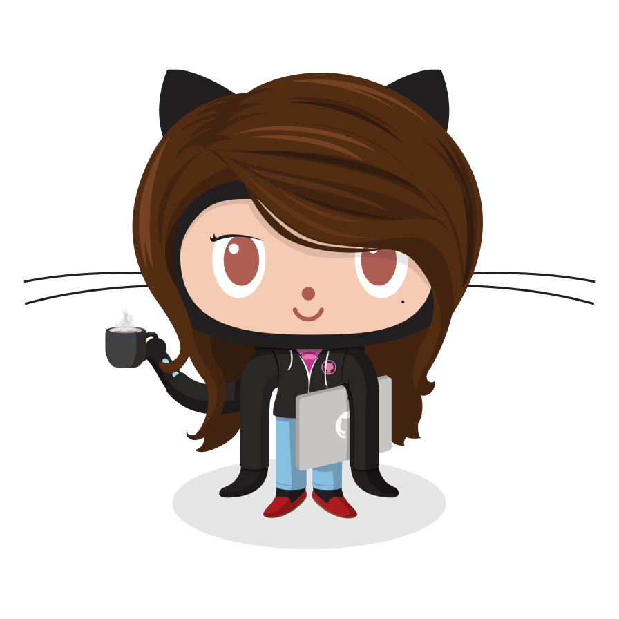

<!-- HEADER / HERO LAYOUT WITH TOP AVATAR -->
<table>
  <tr>
    <td width="60%" valign="middle">
       
      
        
      
<strong>Building innovative, user-centered digital experiences through software engineering, AI, and design.</strong>

       
      
    </td>
    <td width="40%" valign="middle" align="center">
      
    </td>
  </tr>
</table>

---

## 🛠️ Dashboard

### 👩‍💻 About Me

- 🎓 Third-Year **Bachelor of Information and Communication Technology (Honours)** Undergraduate at the **University of Vavuniya**
- 💻 Passionate about **Software Engineering**, **Full-Stack Development**, **Mobile App Development**, and **UI/UX Design**
- 🌱 Currently learning **React Native**, **Docker**, **Java**, **.NET**, and modern software engineering practices
- 🤖 Interested in **Artificial Intelligence**, **Prompt Engineering**, and Human-Centered Design
- 🚀 Love turning ideas into real-world applications
- 📍 Sri Lanka 🇱🇰

---

### 📊 Real-Time GitHub Analytics

<!-- STREAK ROW WITH THEMED HOODIE OCTOCAT AS AN ASSET ICON -->
<table>
  <tr>
    <td width="25%" valign="middle" align="center">
      
    </td>
    <td width="75%" valign="middle">
      
    </td>
  </tr>
</table>

 

<table>
  <tr>
    <td width="50%" valign="top">
      
    </td>
    <td width="50%" valign="top">
      
    </td>
  </tr>
</table>

---

### 🚀 Featured Projects

- **📱 [Nivora](https://github.com/Praveena32):** AI-powered emotional wellness mobile application built with React Native & Expo.
- **🍽 [Dishvana](https://github.com/Praveena32):** Modern restaurant website with responsive UI and interactive user experience.
- **🎓 [SUAMS](https://github.com/Praveena32):** Smart University Attendance Management System.
- **🌍 [Personal Portfolio](https://github.com/Praveena32):** Responsive portfolio showcasing projects, skills, and achievements.
- **✈️ [Wannasolo](https://github.com/Praveena32):** UI/UX prototype for a solo travel planning application.

---

## 🛠 Tech Stack

### 💻 Languages

  
  
  
  
  
  

### 🌐 Frontend & Mobile

  
  
  
  
  

### ⚙️ Backend & Infrastructure

  
  
  
  

---

## 🏆 Achievements

- 🏅 **Oracle Cloud Infrastructure 2025 AI Foundations Associate**
- 🏆 **Top 11 Finalist** – Hackforce'25 Salesforce Hackathon
- 🥈 **6th Place** – INNOVA Ideathon 2025 (IEEE)

---

<!-- FOOTER SECTION WITH LOWER EMBEDDED GRAPHIC CARD -->
## 📫 Connect with Me

 

  

 

  
  
  

 

  ⭐ <em>Thanks for visiting my profile! Let's build something amazing together.</em>

